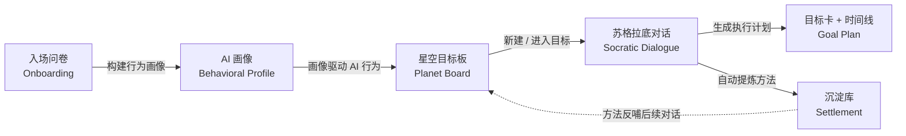
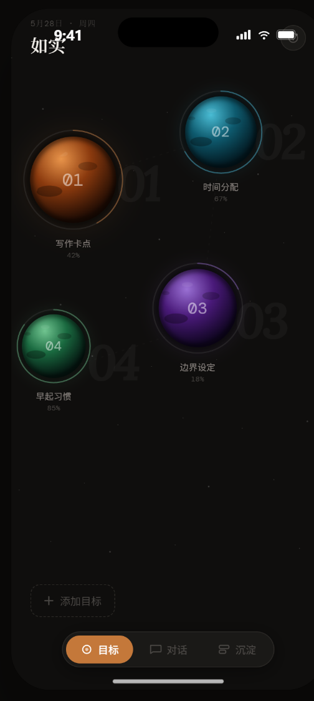
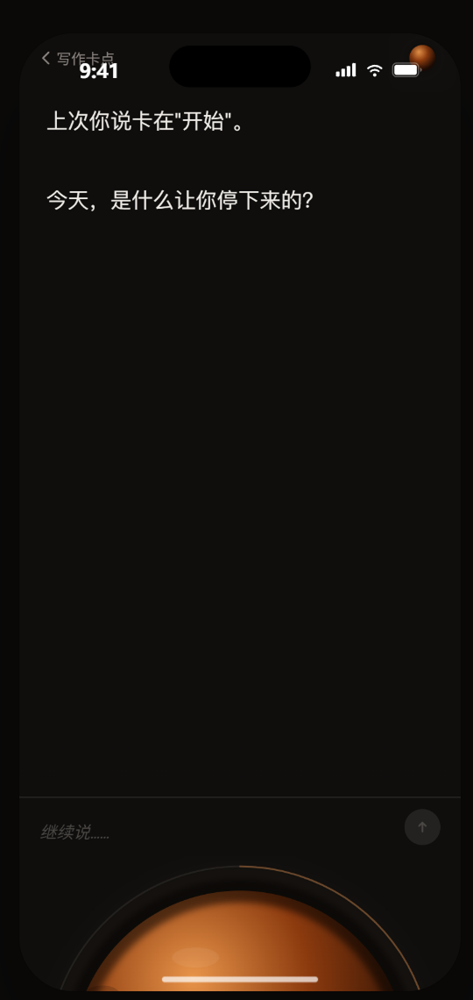
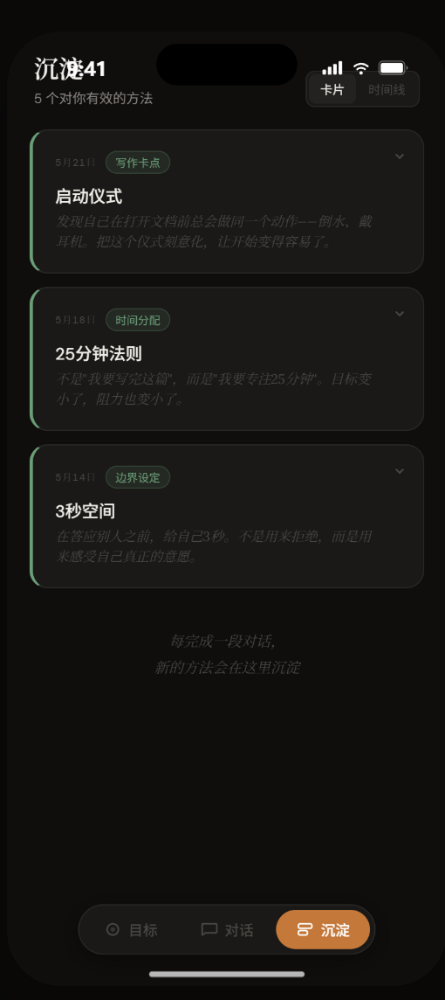
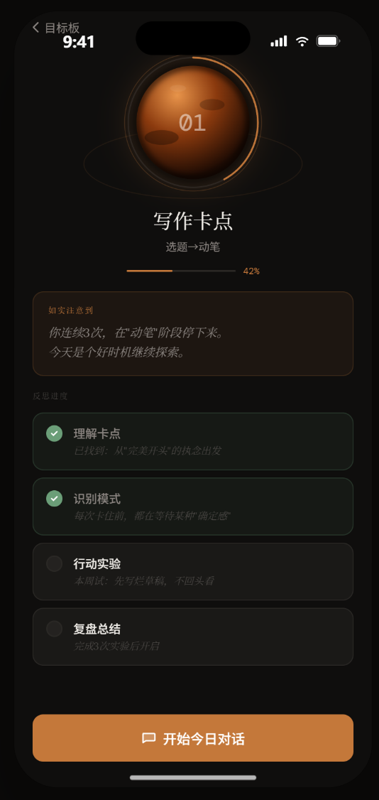

<div align="center">


# 如实 · RUSHI

**一个让你无法逃避自己的 AI 执行伴侣**
*An AI execution companion that won't let you hide from yourself.*

[](https://expo.dev)
[](https://reactnative.dev)
[](https://www.typescriptlang.org)
[](https://www.deepseek.com)
[](LICENSE)

</div>

---

> **我们不承诺帮你完成任务，只承诺让你更清晰地看见自己。**
> *We don't promise to finish your work — only to help you see yourself more clearly.*

## 关于 · About

**如实**是一款中文 AI 反思陪伴 App。它通过**苏格拉底式对话**——只提问、不评判、引导自省——帮你面对拖延、发现未完成计划背后真正的原因。

*RUSHI is a Chinese-language AI reflection companion. Through Socratic dialogue — questions, not judgments — it helps you face procrastination and uncover the real reasons behind unfinished plans.*

它不做打卡监督，也不给鸡汤建议。它要做的只有一件事：**让你诚实地看见自己卡在了哪里、为什么。**

*No streaks, no motivational slogans. Just one thing: an honest look at where you're stuck — and why.*

## 核心隐喻 · The Planet Metaphor

每个「成长目标」是一颗**星球**，所有目标组成一片**星空目标板**。你通过与 AI 的对话推进每一颗星球，把有效的洞察**沉淀**成可回顾的卡片与时间线。

*Every goal is a planet; together they form a constellation. You advance each planet through dialogue, and distill real insight into cards and a timeline you can revisit.*

整体气质是**深空、克制、文学性**——深黑底 + 暖橙强调色 + 衬线体，接近一本「夜间日记」而非工具型 App。

*The mood is deep space, restraint, and literary warmth — near-black canvas, warm amber accent, serif type. Closer to a night journal than a productivity tool.*

## 功能亮点 · Features

| | 功能 | 说明 |
|---|---|---|
| 🪐 | **星空目标板** *Planet Board* | 每个目标是一颗可动的星球：进度环、轨道漂浮动画、星球间虚线连接，组成一片星空。 |
| 🧭 | **入场问卷 → AI 行为画像** *Onboarding → Behavioral Profile* | 4 模块问卷扫描你的执行人格，生成多维度画像，让 AI 据此调整提问方式与分寸。 |
| 💬 | **三套苏格拉底对话** *Three Socratic Dialogues* | 总体反思、目标打卡、新建目标引导（内嵌丰田 8 步法），只问不答、引导自省。 |
| 🎯 | **目标卡 + 分阶段执行计划** *Goal Card + Phased Plan* | AI 生成递减粒度的执行计划，任务关联具体卡点，沿时间线推进。 |
| ✨ | **自动方法沉淀** *Auto Method Settlement* | 从对话中自动提炼有效方法，卡片 / 时间线双视图，同名方法再出现时标记「已验证」。 |
| 🔒 | **本地优先 · 隐私** *Local-first & Private* | 所有数据仅存本地 AsyncStorage，AI 调用走直连或自建代理，不落第三方云端。 |

## 工作原理 · How It Works

如实最核心的机制有两点：

**1. 画像驱动的 AI。** 入场问卷生成你的行为画像，`buildProfileContext()` 把它转译成 AI 的行为指令——不是让 AI「了解」你，而是让 AI **调整自己**来配合你。比如你反感说教，它就从语式里删掉「你应该」。

*The AI adapts to you. Your profile is translated into behavioral instructions — if you dislike preachiness, it drops "you should" from its vocabulary.*

**2. `---INTERFACE---` 双段协议。** AI 的每次回复拆成两段：一段对话文本给你看，一段 JSON 指令驱动前端界面——弹出进度控件、生成真因卡片、展开行动计划。

*Each AI reply is split in two: prose for you, and a JSON action that drives the UI — progress controls, cause cards, action plans.*



## 截图预览 · Screenshots

<div align="center">
  <table>
    <tr>
      <td align="center"><br /><sub>星空目标板 · Planet Board</sub></td>
      <td align="center"><br /><sub>目标对话 · Socratic Chat</sub></td>
    </tr>
    <tr>
      <td align="center"><br /><sub>沉淀库 · Settlement</sub></td>
      <td align="center"><br /><sub>新建目标 · Add Goal</sub></td>
    </tr>
  </table>
</div>

## 技术栈 · Tech Stack

| 分类 | 技术 |
|---|---|
| **框架** | Expo SDK 54 · React Native 0.81 · React 19 |
| **路由** | expo-router（file-based routing） |
| **动画 / 图形** | react-native-reanimated · react-native-svg |
| **字体** | Lora（衬线）· DM Sans（UI）· DM Mono（等宽） |
| **存储** | @react-native-async-storage/async-storage |
| **AI** | DeepSeek API（直连或自建代理） |
| **语言** | TypeScript（strict） |

## 快速开始 · Getting Started

### 1. 配置环境变量

支持两种接入模式，二选一：

```bash
cp .env.example .env
```

```bash
# 直连模式（推荐，最快）：填入 DeepSeek API Key
EXPO_PUBLIC_DEEPSEEK_API_KEY=sk-xxx

# 或中转模式（保护 Key，适合分享/部署）：
# EXPO_PUBLIC_API_URL=https://your-proxy.example.com
```

### 2. 安装 & 启动

```bash
npm install
npx expo start
```

手机安装 **Expo Go** 扫码即可预览；也可用 `npm run android` / `npm run ios` / `npm run web`。

*Install Expo Go on your phone and scan the QR code — or run `npm run android` / `ios` / `web`.*

## 项目结构 · Project Structure

```
app/                    # expo-router 页面（文件路由）
  (tabs)/               # 底部 Tab：目标板 / 对话 / 沉淀
  goal/[id]/            # 目标详情 + 目标对话
  onboarding.tsx        # 入场问卷 → AI 画像
  add-goal.tsx          # 新建目标（AI 引导，全屏 modal）
components/             # 可复用组件（星球 / TabBar / 打字机…）
constants/              # 品牌文案 · 颜色 · 字体 · 间距 token
contexts/               # React Context 全局状态
services/               # 业务逻辑层
  chat.ts               # DeepSeek API 封装
  prompts.ts            # 各场景 system prompt
  profile.ts            # 问卷分析 + 画像 → AI 行为指令
  parser.ts             # ---INTERFACE--- 指令解析
  cards.ts              # 卡片系统
  storage.ts            # AsyncStorage 持久化
types/                  # TypeScript 数据模型
design_handoff_rushi/   # 高保真设计源文件 + 交接文档
docs/                   # 项目文档
```

## 设计系统 · Design System

| Token | 值 | 用途 |
|---|---|---|
| `bg0` | `#0F0E0D` | 主背景（近黑暖调） |
| `acc` | `#C4783A` | 强调色（暖橙）— 按钮、进度、激活态 |
| `t0` | `#F0EDE8` | 主文字（暖白） |
| `t1` | `#8A8480` | 次级文字 |
| `bdr` | `#2A2825` | 描边 / 分割线 |
| `success` | `#6B9E78` | 完成态绿 |

三字体体系（Lora 衬线承载「低语感」、DM Sans 做 UI、DM Mono 做元信息）+ 四套星球调色板（暖橙 / 青蓝 / 紫 / 绿）。

完整规格见 [`design_handoff_rushi/`](design_handoff_rushi/README.md)。

## 路线图 · Roadmap

项目处于活跃的早期开发阶段（v1.0.0）。当前已完成：入场问卷 → AI 行为画像、三套苏格拉底对话、目标卡 + 分阶段执行计划、自动方法沉淀。欢迎提 Issue / PR 一起迭代。

*Early active development (v1.0.0). Core loop is in place; ideas and PRs are welcome.*

## 免责声明 · Disclaimer

> 如实不是一个心理健康诊断或治疗工具。如果你正处于严重的心理困扰中，请寻求专业的心理咨询帮助。如实致力于帮助你观察自己的行为模式、识别阻碍因素，但不会替代专业的心理健康服务。
>
> *RUSHI is not a mental-health diagnosis or treatment tool. If you're in serious distress, please seek professional help. It helps you observe patterns and blockers — it does not replace professional care.*

## 许可 · License

[MIT](LICENSE)
