# RUSHI 用户交互流程图

```mermaid
flowchart TD
    %% ============================================================
    %% 入口
    %% ============================================================
    START(["🚀 用户打开 App"]) --> ROOT["RootLayout<br/>AppProvider 包裹全局"]
    ROOT --> CHECK{"state.disclaimerAccepted<br/>=== true ?"}

    %% ============================================================
    %% Onboarding 流程 (未接受免责声明)
    %% ============================================================
    CHECK -->|"❌ 否（新用户）"| ONB_INDEX["免责声明页<br/>onboarding/index"]
    ONB_INDEX -->|"「我已理解，确认并继续」"| ONB_Q["开场提问页<br/>onboarding/questions<br/>3 道题，逐题回答"]
    ONB_INDEX -->|"「退出应用」"| ALERT_EXIT["Alert: 感谢了解，欢迎再回来"]
    ALERT_EXIT --> ONB_INDEX

    ONB_Q -->|"「上一题」"| ONB_Q
    ONB_Q -->|"「下一题」→ 第3题完成"| ONB_PROFILE["用户画像卡<br/>onboarding/profile<br/>展示 AI 解析的画像"]
    ONB_PROFILE -->|"「返回修改回答」"| ONB_Q
    ONB_PROFILE -->|"「进入如实」<br/>completeOnboarding()"| TABS

    %% ============================================================
    %% 主界面 — 底部 4 Tab
    %% ============================================================
    CHECK -->|"✅ 是（已接受）"| TABS["底部 Tab 导航<br/>(tabs)/_layout<br/>4 个 Tab"]

    %% Tab 1: 首页
    TABS --> TAB1["🏠 首页 (Dashboard)<br/>(tabs)/index"]
    TAB1 -->|"点击活跃目标卡片"| GOAL_DETAIL
    TAB1 -->|"「新建目标」按钮"| GOAL_NEW
    TAB1 -->|"「方法库」按钮"| TAB3
    TAB1 -->|"点击头像图标"| TAB4

    %% Tab 2: 目标
    TABS --> TAB2["🎯 目标列表<br/>(tabs)/goals"]
    TAB2 -->|"点击目标卡片"| GOAL_DETAIL
    TAB2 -->|"FAB 浮动按钮"| GOAL_NEW

    %% Tab 3: 方法库
    TABS --> TAB3["📚 方法库<br/>(tabs)/methods<br/>展示已沉淀方法"]

    %% Tab 4: 我的
    TABS --> TAB4["👤 我的<br/>(tabs)/profile<br/>用户画像 / 统计 / 设置"]

    %% ============================================================
    %% 目标创建流程
    %% ============================================================
    GOAL_NEW["新建目标<br/>goal/new — 3 阶段表单"]
    GOAL_NEW -->|"Stage 1: 明确问题"| GAP["填写目标名称 / 期待 / 现状<br/>→ 实时差距预览"]
    GAP -->|"「下一步」"| FACTORS["Stage 2: 分析问题<br/>添加关键因素标签"]
    FACTORS -->|"「上一步」"| GAP
    FACTORS -->|"「下一步」"| TARGET["Stage 3: 设定目标<br/>做什么 / 到什么程度 / 什么时候"]
    TARGET -->|"「上一步」"| FACTORS
    TARGET -->|"「创建目标」<br/>addGoal() → router.replace"| GOAL_DETAIL

    %% ============================================================
    %% 目标详情 → 分析子页面
    %% ============================================================
    GOAL_DETAIL["目标详情<br/>goal/[id]/index<br/>差距 / 因素 / 目标卡 / 进度"]
    GOAL_DETAIL -->|"「汇报进度」"| PROGRESS_ALERT["Alert: 选择 0% / 25% / 50% / 75% / 100%"]
    PROGRESS_ALERT --> GOAL_DETAIL

    GOAL_DETAIL -->|"「Step 4 · 5Why 追问」"| WHY["5Why 追问引擎<br/>goal/[id]/why<br/>AI 连环追问（最多 5 轮）"]
    GOAL_DETAIL -->|"「Step 4 · 4M1E 分解」"| ANALYSIS["4M1E 要因分解<br/>goal/[id]/analysis<br/>人·机·料·法·环 五维度"]
    GOAL_DETAIL -->|"「Step 5-6 · 制定对策」"| COUNTER["对策方案对比<br/>goal/[id]/countermeasures<br/>3 个预设方案，选 1 个"]
    GOAL_DETAIL -->|"「Step 7 · 成果评价」"| REVIEW["成果评价<br/>goal/[id]/review<br/>达成度 / 真因 / 反思"]
    GOAL_DETAIL -->|"← 返回（Header back）"| TABS

    %% 5Why 内部流程
    WHY -->|"每轮：用户输入回答 → send"| WHY_LOOP["AI 生成下一问<br/>最多 5 轮"]
    WHY_LOOP -->|"< 5 轮，继续回答"| WHY
    WHY_LOOP -->|"满 5 轮 →「进入 4M1E 分析」"| ANALYSIS
    WHY -->|"← 返回"| GOAL_DETAIL

    %% 4M1E 内部流程
    ANALYSIS -->|"「保存分析」→ Alert"| ANALYSIS_ALERT{"保存成功，是否进入<br/>下一步制定对策？"}
    ANALYSIS_ALERT -->|"「稍后」"| ANALYSIS
    ANALYSIS_ALERT -->|"「制定对策」"| COUNTER
    ANALYSIS -->|"← 返回"| GOAL_DETAIL

    %% 对策内部流程
    COUNTER -->|"首次进入：点击<br/>「基于真因生成对策方案」"| COUNTER_SHOW["展示 3 个方案<br/>A: 渐进调整 / B: 环境重构 / C: 重新定义"]
    COUNTER_SHOW -->|"选择方案"| COUNTER_SELECTED["显示方案详情<br/>代价 / 可行性 / 优缺点"]
    COUNTER_SELECTED -->|"「确认选择，进入成果评价」"| REVIEW
    COUNTER -->|"← 返回"| GOAL_DETAIL

    %% 评价 → 两种结局
    REVIEW -->|"「提交评价」"| REVIEW_CHECK{"达成度 ≥ 70%<br/>AND 真因已解决？"}
    REVIEW_CHECK -->|"❌ 否 → 需要下一轮"| LOOP_ALERT["Alert: 建议回到 Step 4"]
    LOOP_ALERT -->|"「稍后处理」"| REVIEW
    LOOP_ALERT -->|"「重新 5Why」"| WHY

    REVIEW_CHECK -->|"✅ 是 → 收尾"| COMPLETE["handleCompleteGoal()<br/>保存方法 → 方法库<br/>生成复盘报告"]
    COMPLETE -->|"「查看方法库」→ router.replace"| TAB3
    COMPLETE -->|"「返回首页」→ router.replace"| TAB1
    REVIEW -->|"← 返回"| GOAL_DETAIL

    %% ============================================================
    %% 样式
    %% ============================================================
    classDef start fill:#4CAF50,color:#fff,stroke:#388E3C
    classDef onboarding fill:#FF9800,color:#fff,stroke:#F57C00
    classDef tabs fill:#2196F3,color:#fff,stroke:#1976D2
    classDef goal fill:#9C27B0,color:#fff,stroke:#7B1FA2
    classDef analysis fill:#00BCD4,color:#fff,stroke:#0097A7
    classDef review fill:#E91E63,color:#fff,stroke:#C2185B
    classDef complete fill:#4CAF50,color:#fff,stroke:#388E3C
    classDef decision fill:#FFEB3B,color:#333,stroke:#FBC02D

    class START start
    class ONB_INDEX,ONB_Q,ONB_PROFILE,ALERT_EXIT onboarding
    class TAB1,TAB2,TAB3,TAB4,TABS tabs
    class GOAL_NEW,GAP,FACTORS,TARGET goal
    class WHY,WHY_LOOP,ANALYSIS,COUNTER,COUNTER_SHOW,COUNTER_SELECTED analysis
    class REVIEW,LOOP_ALERT,REVIEW_CHECK review
    class COMPLETE complete
    class CHECK,ANALYSIS_ALERT decision
```

## 关键导航逻辑说明

| 位置 | 机制 | 说明 |
|------|------|------|
| 免责声明 → 提问 | `router.push` | 堆叠导航，但 gestureEnabled=false 禁止右滑返回 |
| 提问 → 画像卡 | `router.push` + params | 将 3 个回答 JSON 序列化传递给 profile 页 |
| 画像卡 → 修改 | `router.back()` | 返回提问页重新填写 |
| 画像卡 → 进入 | `router.replace('/')` | 替换整个导航栈，进入 Tab 主页 |
| 目标创建 → 详情 | `router.replace` | 替换新建页，避免返回到空表单 |
| 详情 → 子页面 | `router.push` | 堆叠导航，Header 自动显示返回按钮 |
| 5Why → 4M1E | `router.replace` | 替换当前页，避免回到已完成的 5Why |
| 收尾 → 首页/方法库 | `router.replace` | 清除分析栈，回到 Tab 首页 |
| Tab 间切换 | Bottom Tabs | 自由切换，各自保持独立导航状态 |
