# RUSHI 用户交互流程图 · 第二版

```mermaid
flowchart TD
    %% ============================================================
    %% 入口
    %% ============================================================
    START(["🚀 用户打开 App"]) --> ROOT["RootLayout · AppProvider"]
    ROOT --> CHECK{"disclaimerAccepted?"}

    %% ============================================================
    %% Onboarding（新用户）
    %% ============================================================
    CHECK -->|"❌ 新用户"| ONB_INDEX["免责声明页\nonboarding/index"]
    ONB_INDEX -->|"「退出」"| ALERT_EXIT["Alert: 欢迎再回来"]
    ALERT_EXIT --> ONB_INDEX
    ONB_INDEX -->|"「确认继续」"| ONB_Q["开场提问页\n3 道问题 · 逐题回答\nonboarding/questions"]
    ONB_Q -->|"「上一题」"| ONB_Q
    ONB_Q -->|"第 3 题完成"| ONB_PROFILE["用户画像卡\nAI 解析画像\nonboarding/profile"]
    ONB_PROFILE -->|"「返回修改」"| ONB_Q
    ONB_PROFILE -->|"「进入如实」completeOnboarding()"| TABS

    %% ============================================================
    %% 主界面 — 底部 4 Tab
    %% ============================================================
    CHECK -->|"✅ 老用户"| TABS["底部 Tab 导航 · 4 个 Tab"]

    TABS --> TAB1["🏠 首页 Dashboard\n活跃目标卡 · 今日打卡提示\n进度可视化摘要"]
    TABS --> TAB2["🎯 目标列表\ngoals"]
    TABS --> TAB3["📚 方法库\n已沉淀方法 · AI 自动归档"]
    TABS --> TAB4["👤 我的\n画像 / 统计 / 设置"]

    TAB1 -->|"点击目标卡"| GOAL_DETAIL
    TAB1 -->|"「今日打卡」提示 banner"| CHECKIN
    TAB1 -->|"「新建目标」"| GOAL_NEW
    TAB2 -->|"点击目标"| GOAL_DETAIL
    TAB2 -->|"FAB 按钮"| GOAL_NEW

    %% ============================================================
    %% 目标创建 ——「AI 引导式对话」替代结构化表单
    %% ============================================================
    GOAL_NEW["新建目标入口\ngoal/new"]
    GOAL_NEW --> GUIDED_CHAT["🤖 AI 引导对话\n目标澄清三问\n① 你想改变什么？\n② 现状是什么？\n③ 你期待什么？\n\n⚡ AI 实时预测 + 标签推荐\n用户可点选 or 自由输入"]
    GUIDED_CHAT --> GOAL_PREVIEW["目标预览卡\nAI 生成：目标名称 · 差距描述\n关键因素标签（可编辑）"]
    GOAL_PREVIEW -->|"「重新描述」"| GUIDED_CHAT
    GOAL_PREVIEW -->|"「确认创建」addGoal()"| GOAL_DETAIL

    %% ============================================================
    %% 目标详情页（核心重构）
    %% ============================================================
    GOAL_DETAIL["目标详情\ngoal/[id]/index\n\n① 进度环 + 当前阶段标签\n② 本周打卡记录\n③「继续分析」悬浮引导按钮\n④ AI 动态下一步提示"]

    GOAL_DETAIL -->|"「打卡」浮动按钮"| CHECKIN
    GOAL_DETAIL -->|"「深入分析」AI 引导"| AI_COACH
    GOAL_DETAIL -->|"「查看对策」（已解锁）"| COUNTER
    GOAL_DETAIL -->|"「复盘评价」（已解锁）"| REVIEW
    GOAL_DETAIL -->|"← 返回"| TABS

    %% ============================================================
    %% 打卡 ——「富文本汇报」替代百分比选择
    %% ============================================================
    CHECKIN["打卡 / 汇报进度\ngoal/[id]/checkin\n\n文字描述 + 图片上传\n进度滑块（0–100%）\nAI 实时点评：「你提到了…\n这说明你在…」"]
    CHECKIN -->|"「提交」"| CHECKIN_AI["AI 解读打卡内容\n更新进度 · 判断是否触发下一步引导"]
    CHECKIN_AI -->|"进度正常"| GOAL_DETAIL
    CHECKIN_AI -->|"检测到卡点 → 建议深入分析"| AI_COACH_TRIGGER["弹窗：「看起来你在\n[X] 上遇到了阻力，\n要和我聊聊吗？」"]
    AI_COACH_TRIGGER -->|"「稍后」"| GOAL_DETAIL
    AI_COACH_TRIGGER -->|"「现在聊」"| AI_COACH

    %% ============================================================
    %% AI 教练对话（整合 5Why + 4M1E，用户无感知）
    %% ============================================================
    AI_COACH["🤖 AI 教练对话\ngoal/[id]/coach\n\n后台框架：丰田八步法\n前台呈现：自然对话\n\n・AI 根据打卡内容\n  动态生成追问\n・用户无需知道「步骤编号」\n・支持文字 / 点选建议项"]

    AI_COACH --> AI_COACH_LOOP["追问循环\nAI 判断：\n① 继续追问（真因未明）\n② 生成洞察摘要（真因已明）"]
    AI_COACH_LOOP -->|"继续追问"| AI_COACH
    AI_COACH_LOOP -->|"真因已明 → 生成洞察"| INSIGHT_CARD["洞察卡片\n真因描述 · 关键因素归因\nAI 保存至用户画像"]
    INSIGHT_CARD -->|"「继续，看看有什么对策」"| COUNTER
    INSIGHT_CARD -->|"「先记下来，稍后处理」"| GOAL_DETAIL

    %% ============================================================
    %% 对策方案
    %% ============================================================
    COUNTER["对策方案\ngoal/[id]/countermeasures\n\n基于真因 AI 生成 3 方案\nA 渐进调整 · B 环境重构 · C 重新定义\n每案：代价 / 可行性 / 优缺点"]
    COUNTER -->|"选择方案 → 「确认执行」"| COUNTER_COMMIT["记录选定方案\n设置执行提醒（可选）"]
    COUNTER_COMMIT --> GOAL_DETAIL
    COUNTER -->|"← 返回"| GOAL_DETAIL

    %% ============================================================
    %% 复盘评价
    %% ============================================================
    REVIEW["复盘评价\ngoal/[id]/review\n\n达成度滑块\n真因是否解决 · 反思文字"]
    REVIEW -->|"「提交复盘」"| REVIEW_CHECK{"达成度 ≥ 70%\n且真因已解决？"}
    REVIEW_CHECK -->|"❌ 未达成 → 需新一轮"| LOOP_SUGGEST["AI 建议：\n「这次卡在了[Y]，\n要重新聊聊吗？」"]
    LOOP_SUGGEST -->|"「稍后」"| GOAL_DETAIL
    LOOP_SUGGEST -->|"「重新分析」"| AI_COACH

    REVIEW_CHECK -->|"✅ 达成 → 收尾"| COMPLETE["目标完成\n\nAI 自动提炼有效方法\n弹窗：「要把这个方法\n存入方法库吗？」"]
    COMPLETE -->|"「保存到方法库」"| METHOD_SAVE["方法沉淀\nAI 生成方法卡标题 + 摘要\n自动归档至 TAB3"]
    COMPLETE -->|"「跳过」"| TAB1
    METHOD_SAVE --> TAB3
    REVIEW -->|"← 返回"| GOAL_DETAIL

    %% ============================================================
    %% 样式
    %% ============================================================
    classDef start fill:#4CAF50,color:#fff,stroke:#388E3C
    classDef onboarding fill:#FF9800,color:#fff,stroke:#F57C00
    classDef tabs fill:#2196F3,color:#fff,stroke:#1976D2
    classDef goal fill:#9C27B0,color:#fff,stroke:#7B1FA2
    classDef ai fill:#00BCD4,color:#fff,stroke:#0097A7
    classDef checkin fill:#FF5722,color:#fff,stroke:#E64A19
    classDef review fill:#E91E63,color:#fff,stroke:#C2185B
    classDef complete fill:#4CAF50,color:#fff,stroke:#388E3C
    classDef decision fill:#FFEB3B,color:#333,stroke:#FBC02D

    class START start
    class ONB_INDEX,ONB_Q,ONB_PROFILE,ALERT_EXIT onboarding
    class TAB1,TAB2,TAB3,TAB4,TABS tabs
    class GOAL_NEW,GUIDED_CHAT,GOAL_PREVIEW,GOAL_DETAIL goal
    class AI_COACH,AI_COACH_LOOP,INSIGHT_CARD,COUNTER,AI_COACH_TRIGGER,CHECKIN_AI ai
    class CHECKIN checkin
    class REVIEW,LOOP_SUGGEST review
    class COMPLETE,METHOD_SAVE,COUNTER_COMMIT complete
    class CHECK,REVIEW_CHECK decision
```

## 第二版 vs 第一版：核心变化对照

| 模块 | 第一版 | 第二版（改动原因） |
|------|--------|-------------------|
| **目标创建** | 3阶段结构化表单（明确问题→分析→设定） | AI 引导对话 + 点选标签，AI 自动生成预览卡 |
| **汇报进度** | 只能选百分比（0/25/50/75/100） | 富文本打卡（文字+图片+滑块）+ AI 实时解读 |
| **5Why / 4M1E** | 两个独立页面，用户显式进入步骤 | 合并为「AI 教练对话」，丰田八步法在后台驱动，用户看不到步骤编号 |
| **方法库** | 需用户手动在完成后操作 | AI 自动识别 + 弹窗确认，一键存入 |
| **深入分析触发** | 用户主动点击 Step 4/5/6/7 | AI 从打卡内容主动识别卡点，推送引导 |
| **目标详情页** | 展示全部 Step 卡片，信息密集 | 进度环 + 阶段标签 + AI 动态提示，极简 |
